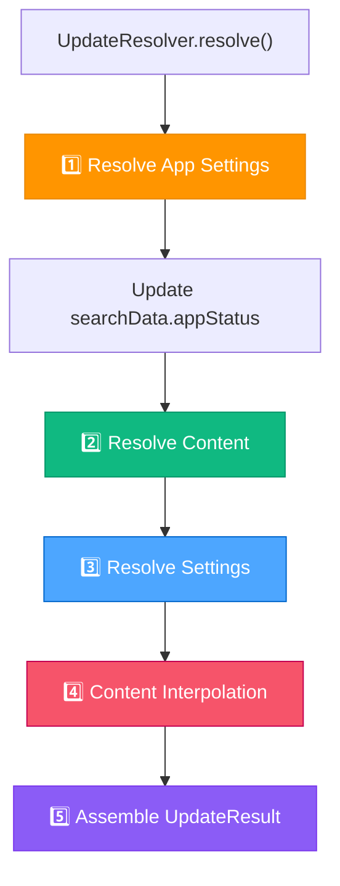
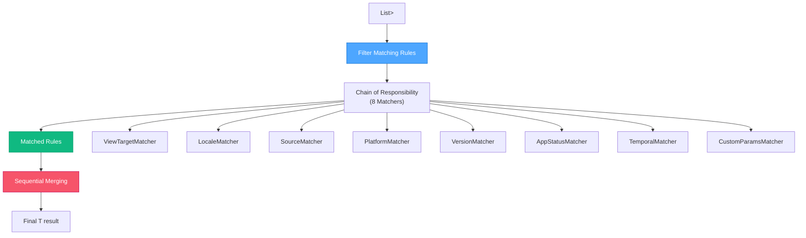
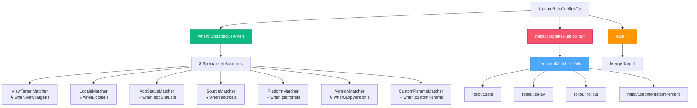
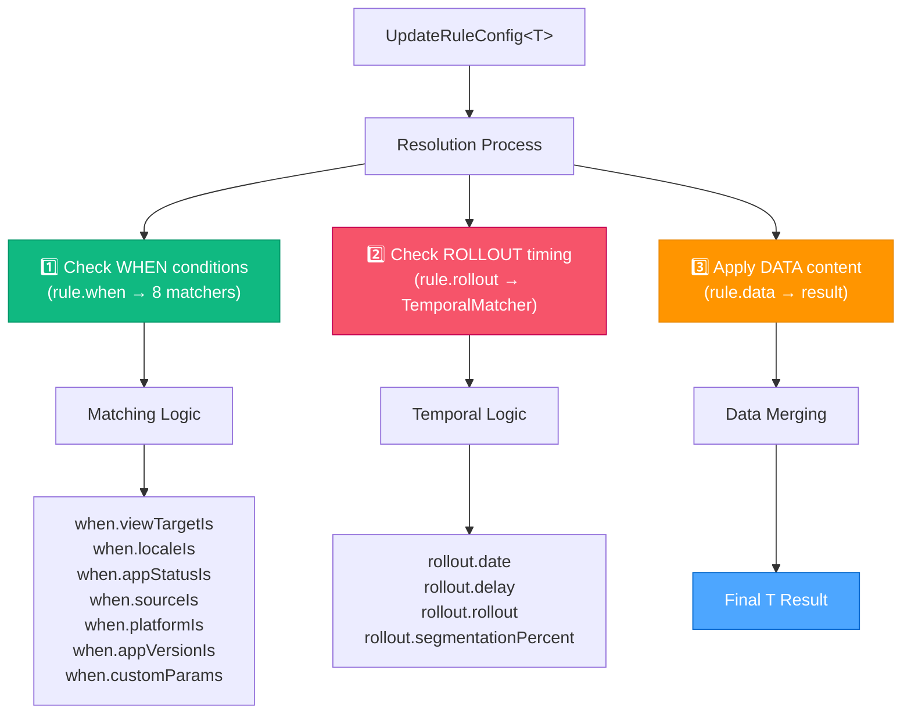

# Resolver System Analysis: App Update Library

## 🎯 Назначение и роль в системе

### Главная миссия Resolver System
**Resolver System** - это "мозг" App Update Library, который **применяет business logic правил** для определения:
- **Что показать** пользователю (content)
- **Как показать** (settings)  
- **Когда показать** (temporal conditions)
- **Кому показать** (segmentation)

### Философия Rules-Based Approach

#### Почему правила, а не hardcoded logic?
```dart
// ❌ Hardcoded approach - негибко:
if (appVersion < Version.parse('2.0.0') && platform == 'android') {
  return UpdateContentData(title: 'Critical Update Required');
}

// ✅ Rules-based approach - flexible:
```
```yaml
content:
  - app_version_is: "<2.0.0"
    platform_is: android  
    data:
      title: "Critical Update Required"
```

**Преимущества Rules**:
1. **Configuration-driven** - изменения без code updates
2. **A/B testing** - разные правила для разных user segments
3. **Gradual rollout** - temporal conditions для controlled deployment
4. **Localization** - content rules per locale
5. **Platform adaptation** - different behavior per platform

## 🏗️ Двухуровневая архитектура

### Level 1: UpdateResolver (Orchestrator)
**Роль**: Координация всего resolution process в правильном порядке



**Критический порядок execution**:
```dart
// 1️⃣ ПЕРВЫМ всегда app_settings - определяет AppStatus
final resolvedAppSettings = _ruleResolver.resolve<UpdateAppSettingsConfig>(
  searchData: searchData,  // ← appStatus может быть null
  rules: appSettingsRules,
);

// 2️⃣ Обновляем searchData с resolved appStatus
if (searchData.appStatus == null) {
  searchData = searchData.copyWith(
    appStatus: resolvedAppSettings.appStatus,  // ← Теперь известен
  );
}

// 3️⃣ Content resolution с known appStatus
final rawResolvedContentConfig = _ruleResolver.resolve<UpdateContentConfig>(
  searchData: searchData,  // ← appStatus уже определен
  rules: contentRules,
);

// 4️⃣ Settings resolution с same known appStatus
final resolvedSettingsConfig = _ruleResolver.resolve<UpdateSettingsConfig>(
  searchData: searchData,  // ← Consistent appStatus
  rules: settingsRules,
);
```

### Level 2: UpdateRuleResolver (Rule Engine)
**Роль**: Generic engine для resolution любых типов правил



## 🔧 Chain of Responsibility - Matcher System

### Порядок матчеров (критически важен!)
```dart
static const defaultMatchers = <RuleMatcher>[
  ViewTargetMatcher(),      // 1️⃣ UI target (card, dialog, screen)
  LocaleMatcher(),          // 2️⃣ Language/region
  SourceMatcher(),          // 3️⃣ Store/platform compatibility  
  PlatformMatcher(),        // 4️⃣ OS platform
  VersionMatcher(),         // 5️⃣ App version constraints
  AppStatusMatcher(),       // 6️⃣ Version lifecycle status
  TemporalMatcher(),        // 7️⃣ Time-based conditions
  CustomParamsMatcher(),    // 8️⃣ Custom field matching (LAST!)
];
```

**Почему этот порядок?**
- **CustomParamsMatcher ПОСЛЕДНИЙ** - может consume/modify customParams
- **TemporalMatcher близко к концу** - expensive calculations
- **Basic matchers первыми** - fast elimination неподходящих rules

### Логика "все должны пройти"
```dart
bool isRuleMatched<T extends Mergeable<T>>({
  required UpdateRuleConfig<T> rule,
  required UpdateSearchData searchData,
}) {
  for (final matcher in matchers) {
    if (!matcher.isMatches(rule: finalRule, search: searchData)) {
      return false;  // ← ANY failure = rule rejected
    }
  }
  return true;  // ← ALL matchers passed = rule accepted
}
```

## 🎨 Key Matchers Deep Dive

### 1. TemporalMatcher - Temporal Logic Engine
**Самый сложный matcher** - обрабатывает время-зависимые условия:

#### A. Segmentation (A/B Testing)
```dart
// Проверка user segmentation:
if (segmentationPercent != null) {
  final threshold = segmentationPercent.clamp(0, 100) / 100.0;
  if (segmentationPointer > threshold) return false;
}

// Example:
// segmentation_percent: 25  →  threshold = 0.25
// segmentationPointer: 0.3  →  0.3 > 0.25 = false (rule rejected)
// segmentationPointer: 0.1  →  0.1 < 0.25 = true (rule accepted)
```

#### B. Dynamic Date Resolution
```dart
DateTime? baseDate = ruleDate.date;  // Статическая дата или null

baseDate ??= switch (ruleDate) {
  UpdateDate.localReleaseDate => localReleaseDate,    // ← Дата текущей версии
  UpdateDate.updateReleaseDate => updateReleaseDate,  // ← Дата последнего обновления
  UpdateDate.appUpdateDate => appUpdateDate,          // ← Дата последнего app update
  UpdateDate.appInstallDate => appInstallDate,        // ← Дата установки app
  _ => null,
};
```

#### C. Progressive Rollout
```dart
// Rollout logic:
if (rollout != null) {
  final elapsed = currentDate.difference(baseDate);
  final fraction = (elapsed.inMilliseconds / rollout.inMilliseconds).clamp(0.0, 1.0);
  if (rolloutPointer > fraction) return false;
}

// Example через 3 дня из 7-дневного rollout:
// elapsed = 3 days, rollout = 7 days
// fraction = 3/7 ≈ 0.43 (43% rollout progress)
// rolloutPointer: 0.2 → 0.2 < 0.43 = true (user gets update)
// rolloutPointer: 0.8 → 0.8 > 0.43 = false (user waits)
```

### 2. CustomParamsMatcher - Flexible Extension Point
**Уникальная особенность**: Support для arbitrary custom fields с intelligent logic

#### Magic суффикса '_is'
```yaml
# В rule customParams - поля с суффиксом '_is':
custom_params:
  env_is: prod              # ← Ищет 'env' в search data  
  user_type_is: [premium, gold]  # ← Ищет 'user_type' в search data
  
# В search customParams - поля без суффикса:
custom_params:
  env: prod                 # ← Matches 'env_is'
  user_type: premium        # ← Matches 'user_type_is'
```

#### Intelligent Field Processing
```dart
for (final entry in ruleCustom.entries) {
  final key = entry.key.toLowerCase();
  if (key.endsWith('_is') && _isPrimitiveValue(entry.value)) {
    // Убираем суффикс '_is' для сопоставления
    final searchKey = key.substring(0, key.length - 3);
    filteredRuleCustom[searchKey] = entry.value;
  }
}

// Result: env_is → env, user_type_is → user_type
```

#### Complex Value Matching
```dart
// Поддержка RegExp patterns:
'env_is': 'regexp:^prod.*'  // ← Matches 'production', 'prod-eu', etc.

// List intersections:
'tags_is': ['alpha', 'beta']     // Rule tags
'tags': ['beta', 'gamma']        // Search tags  
// Result: true (intersection: 'beta')

// Special 'any' value:
'env_is': 'any'  // ← Matches любое значение
```

### 3. SourceMatcher - Platform Compatibility Logic
**Сложная логика**: source + platform compatibility checking

```dart
bool _isSourceSupportsPlatform(
  UpdateSource ruleSource,      // From rule
  UpdatePlatform searchPlatform, // Current platform
  UpdateSource searchSource,    // Available source
) {
  // Platform list priority: rule platforms OR search source platforms
  final rulePlatforms = ruleSource.platforms ?? searchSource.platforms;
  
  if (rulePlatforms == null) {
    // Null platforms = universal compatibility check
    return searchSource.platforms == null;
  }
  
  // Explicit platform check
  return rulePlatforms.contains(UpdatePlatform.any) ||
         rulePlatforms.contains(searchPlatform);
}
```

**Real-world scenario**:
```yaml
# Rule source:
source_is:
  - name: googlePlay
    platforms: [android]  # ← Explicitly android only

# Search context:  
sources: [googlePlay]      # ← Available source
platform: ios              # ← Current platform

# Result: false (googlePlay не supports iOS)
```

## 📋 Types of Rules и их Resolution Order

### 1. App Settings Rules (ПЕРВЫЕ - определяют статус)
**Цель**: Определить жизненный цикл версии и её статус

```yaml
app_settings:
  # Default: all versions active
  - app_version_is: any
    data:
      app_status: active
      
  # Lifecycle progression  
  - date: $localReleaseDate
    delay_hours: 168        # После недели → outdated
    data:
      app_status: outdated
      
  - date: $localReleaseDate  
    delay_hours: 2880       # После 120 дней → deprecated
    data:
      app_status: deprecated
```

**Resolution outcome**: `appStatus` определен для дальнейшего использования

### 2. Content Rules (ВТОРЫЕ - используют resolved appStatus)
**Цель**: Определить что показать пользователю

```yaml
content:
  # Base content для всех
  - data:
      title: "Update Available"
      description: "New version available"
      
  # Status-specific content (использует resolved appStatus!)
  - app_status_is: deprecated  # ← Resolved from app_settings
    data:
      title: "Important Update"
      description: "Your version is deprecated"
      
  # Localized content
  - locale_is: ru
    app_status_is: deprecated
    data:
      title: "Важное обновление"
```

### 3. Settings Rules (ТРЕТЬИ - тоже используют appStatus)
**Цель**: Определить поведение UI и доступные действия

```yaml
settings:
  # Default: hide everything
  - data:
      should_show: false
      can_skip: false
      can_postpone: false
      
  # Status-dependent behavior (используют resolved appStatus!)
  - app_status_is: active
    view_target_is: aboutScreen
    data:
      should_show: true       # Show only in about screen
      
  - app_status_is: deprecated
    data:
      should_show: true       # Show everywhere
      can_skip: false         # Cannot skip
      can_postpone: true      # Can postpone briefly
```

### 4. Content Interpolation (ПОСЛЕДНЕЕ)
**Цель**: Подстановка переменных в finalized content

```dart
// After rule resolution, interpolate variables:
final resolvedContent = _contentInterpolator.interpolate(
  updateContent: rawResolvedContent,  // ← From content rules
  searchData: searchData,             // ← With known appStatus
  updateData: updateData,
);

// $appName → "My App", $releaseVersion → "2.1.0", etc.
```

## 🔄 Rule Resolution Process (Step by Step)

### Phase 1: Rule Filtering
```dart
final matchedRules = <UpdateRuleConfig<T>>[];

for (final rule in rules) {
  final isMatched = isRuleMatched(rule: rule, searchData: searchData);
  if (isMatched) {
    matchedRules.add(rule);  // ← Only matched rules continue
  }
}
```

**Matching criteria** (ALL must pass):
- **ViewTarget**: rule target matches search display target
- **Locale**: rule locale matches user locale  
- **Source**: rule source available и compatible с platform
- **Platform**: rule platform matches current platform
- **Version**: app version satisfies rule version constraints
- **AppStatus**: rule status matches current app status
- **Temporal**: time conditions satisfied (date, delay, rollout, segmentation)
- **CustomParams**: custom field conditions satisfied

### Phase 2: Sequential Merging
```dart
T? result;
for (final rule in matchedRules) {
  final data = rule.data;
  result = result?.merge(data) ?? data;  // ← Sequential merge по порядку
}
```

**Merge behavior** (later rules override earlier):
```yaml
# Rule 1:
- data:
    title: "Base Title"
    description: "Base Description"
    
# Rule 2 (more specific):  
- locale_is: ru
  data:
    title: "Russian Title"
    # description remains "Base Description"
    
# Final result:
# title: "Russian Title" (overridden)
# description: "Base Description" (preserved)
```

## 🎯 Matcher Система в деталях

### Simple Matchers (Exact Matching)
```dart
// ViewTargetMatcher - прямое сравнение:
bool isMatches({required UpdateRuleConfig rule, required UpdateSearchData search}) {
  final ruleTargets = rule.viewTargetIs ?? [UpdateViewTarget.any];
  final searchTarget = search.displayTarget;
  
  return ruleTargets.contains(UpdateViewTarget.any) || 
         ruleTargets.contains(searchTarget);
}
```

### Complex Matchers (Business Logic)

#### VersionMatcher - Semantic Version Constraints
```dart
// Поддержка semver constraints:
">=1.0.0 <2.0.0"  // ← Parsed в VersionConstraint
"^1.5.0"          // ← Compatible версии
">2.0.0"          // ← Только newer versions

bool isMatches(...) {
  final constraints = rule.appVersionIs ?? [UpdateVersionConstraint.any];
  if (constraints.contains(UpdateVersionConstraint.any)) return true;
  
  for (final c in constraints) {
    final vc = c.versionConstraint;
    if (vc != null && vc.allows(search.appVersion)) return true;  // ← pub_semver logic
  }
  return false;
}
```

#### SourceMatcher - Multi-Dimensional Compatibility  
**Challenge**: Source + Platform + Availability matching

```dart
// Real-world example:
// Rule: googlePlay для android/ios
// Search: googlePlay available, current platform = android
// Result: true (googlePlay supports android)

// Rule: appStore для ios/macos  
// Search: appStore available, current platform = android
// Result: false (appStore НЕ supports android)
```

### Advanced Matcher: CustomParamsMatcher

#### Суффикс '_is' Convention
```yaml
# Rule side (pattern matching):
custom_params:
  env_is: prod                    # ← Looks for 'env' in search
  user_type_is: [premium, gold]   # ← List matching
  region_is: regexp:^eu.*         # ← RegExp support
  
# Search side (actual data):  
custom_params:
  env: production                 # ← Matches 'env_is'
  user_type: premium              # ← In list
  region: eu-west                 # ← Matches regexp
```

#### Security через Field Filtering
```dart
// Only process fields ending с '_is':
final hasUnknownFields = ruleCustom.keys.any(
  (key) => !key.toLowerCase().endsWith('_is')
);
if (hasUnknownFields) {
  return false;  // ← Reject rule с unknown fields (security)
}

// Filter и process только _is fields:
for (final entry in ruleCustom.entries) {
  final key = entry.key.toLowerCase();
  if (key.endsWith('_is') && _isPrimitiveValue(entry.value)) {
    final searchKey = key.substring(0, key.length - 3);  // Remove '_is'
    filteredRuleCustom[searchKey] = entry.value;
  }
}
```

## ⏰ Temporal Logic - Production Rollout Control

### Comprehensive Time-Based Control
```yaml
# Example production rollout rule:
app_settings:
  - date: $updateReleaseDate      # ← Base: latest release date
    delay_hours: 24               # ← Wait 24h после release
    rollout_hours: 168            # ← Gradual rollout over 7 days  
    segmentation_percent: 25      # ← Only 25% of users
    data:
      app_status: outdated
```

### Temporal Evaluation Logic
```dart
// 1️⃣ Segmentation check (FIRST - fastest to fail):
if (segmentationPercent != null) {
  final threshold = segmentationPercent.clamp(0, 100) / 100.0;
  if (segmentationPointer > threshold) return false;  // ← User not in segment
}

// 2️⃣ Date resolution (dynamic dates):
DateTime? baseDate = ruleDate.date;  // Static date or null
baseDate ??= switch (ruleDate) {
  UpdateDate.localReleaseDate => localReleaseDate,    // ← Current version date
  UpdateDate.updateReleaseDate => updateReleaseDate,  // ← Latest available date
  // ...
};

// 3️⃣ Delay application:
if (delay != null) {
  baseDate = baseDate.add(delay);  // ← Rule becomes active AFTER delay
}

// 4️⃣ Time gate:
if (currentDate.isBefore(baseDate)) return false;  // ← Too early

// 5️⃣ Progressive rollout:
if (rollout != null) {
  final elapsed = currentDate.difference(baseDate);
  final fraction = (elapsed.inMilliseconds / rollout.inMilliseconds).clamp(0.0, 1.0);
  if (rolloutPointer > fraction) return false;  // ← User not yet in rollout
}
```

### Real-World Rollout Scenario
```yaml
# Production release strategy:
app_settings:
  - date: "2024-01-01 09:00:00"  # Release announcement
    delay_hours: 12              # Wait 12h для initial stability
    rollout_hours: 168           # 7-day gradual rollout
    segmentation_percent: 20     # Only 20% of user base
    data:
      app_status: outdated
```

**Timeline execution**:
- **Jan 1 09:00** - Release announced, delay active
- **Jan 1 21:00** - Delay ends, rollout begins (0% progress)
- **Jan 4 21:00** - 50% rollout progress (3 of 7 days)
- **Jan 8 21:00** - 100% rollout complete

**User experience**:
- **segmentationPointer 0.1** (10% user) + **rolloutPointer 0.3** (wants 30% rollout):
  - Day 1-2: ❌ (delay period)
  - Day 3: ❌ (rollout progress ~14%, user wants 30%)
  - Day 4: ✅ (rollout progress ~43%, user gets 30%)

## 📊 Rule Priority и Merging Strategy

### Sequential Rule Application
```dart
// Rules applied в порядке следования:
content:
  - data:                    # Rule 1 (BASE)
      title: "Update"
      description: "Available"
      button: "Update"
      
  - locale_is: ru           # Rule 2 (OVERRIDE some fields)
    data:
      title: "Обновление"    # ← Overrides title
      button: "Обновить"     # ← Overrides button
      # description remains "Available"
      
  - app_status_is: deprecated  # Rule 3 (FURTHER OVERRIDE)
    locale_is: ru
    data:
      title: "Важное обновление"  # ← Final override
      # description: "Available", button: "Обновить" preserved
```

### Mergeable Pattern Implementation
```dart
class UpdateContentConfig implements Mergeable<UpdateContentConfig> {
  @override
  UpdateContentConfig merge(covariant UpdateContentConfig other) =>
    UpdateContentConfig.byRequired(
      updateUrl: other.updateUrl ?? updateUrl,           // ← Last non-null wins
      title: other.title ?? title,                       // ← Last non-null wins
      description: other.description ?? description,     // ← Preserve if not overridden
      // ...
      customParams: Mergeable.mergeCustomParams(customParams, other.customParams),
    );
}

// Custom params merging - Map spreading:
static Map<String, dynamic>? mergeCustomParams(...) {
  final customParams = {
    ...?customParams1,    // ← Earlier rules
    ...?customParams2,    // ← Later rules (override)
    ...?customParams3,
  };
  return customParams.isNotEmpty ? customParams : null;
}
```

## 🎯 Default Rules Strategy

### Built-in Default Rules
App Update Library поставляется с intelligent defaults:

#### 1. Default Content Rules
```dart
// English content (base):
final defaultEnContentRules = [
  const UpdateRuleConfig(
    localeIs: [UpdateLocale.en, UpdateLocale.any],
    data: UpdateContentConfig.byRequired(
      title: r'Update $appName',
      description: r'Version $releaseVersion is now available, current - $appVersion.',
      updateButton: 'Update',
      skipButton: 'Skip', 
      postponeButton: 'Later',
      // ...
    ),
  ),
  
  // Specific messaging для unsupported versions:
  const UpdateRuleConfig(
    appStatusIs: [AppStatus.unsupported],
    localeIs: [UpdateLocale.en, UpdateLocale.any],
    data: UpdateContentConfig(
      title: r'Update $appName',
      description: r'Version $appVersion is no longer supported. Update to $releaseVersion.',
    ),
  ),
];
```

#### 2. Default Settings Rules
```dart
final defaultUpdateSettingsRules = [
  // Conservative defaults:
  const UpdateRuleConfig(
    data: UpdateSettingsConfig.byRequired(
      shouldShow: true,
      canSkip: false,           // ← Safe default
      canPostpone: true,
      skipReleaseDelay: Duration(days: 180),
      postponeReleaseDelay: Duration(days: 7),
    ),
  ),
  
  // Strict rules for critical updates:
  const UpdateRuleConfig(
    appStatusIs: [AppStatus.unsupported],
    data: UpdateSettingsConfig(
      canSkip: false,           // ← Cannot skip critical updates
      canPostpone: false,       // ← Cannot postpone critical updates
    ),
  ),
];
```

#### 3. Default App Settings Rules
```dart
final defaultUpdateAppSettingsRules = [
  // Default: everything is active
  const UpdateRuleConfig(
    data: UpdateAppSettingsConfig.byRequired(
      appStatus: AppStatus.active,  // ← Safe default
    ),
  ),
];
```

### Rules Priority Hierarchy
```
User YAML Config Rules (HIGHEST priority)
        ↓
Default Package Rules (LOWEST priority)
        ↓
        Final Result
```

**Merge order** в UpdateLinker:
```dart
final finalContentRules = Mergeable.mergeRules(
  rulesContainer.contentRules,           // ← User's global rules
  linkRules(globalSource?.contentRules), // ← Source-specific rules
  linkRules(globalSourcePlatform?.contentRules), // ← Platform-specific rules  
  update.contentRules,                   // ← Release-specific rules (HIGHEST)
);
```

## 🔄 Resolution Flow Example

### Complete Resolution Walkthrough
```yaml
# Configuration:
app_settings:
  - app_version_is: "<2.0.0"
    date: $localReleaseDate
    delay_hours: 168
    data:
      app_status: deprecated
      
content:
  - data:
      title: "Update Available"
      
  - app_status_is: deprecated
    data:
      title: "Critical Update Required"
      
  - locale_is: ru
    app_status_is: deprecated  
    data:
      title: "Критическое обновление"

settings:
  - data:
      should_show: false
      can_skip: true
      
  - app_status_is: deprecated
    data:
      should_show: true
      can_skip: false
```

### Execution Flow:
```dart
// Search context:
searchData = UpdateSearchData(
  appVersion: Version.parse('1.5.0'),    // ← < 2.0.0
  locale: UpdateLocale.ru,
  currentDate: DateTime.now(),
  localReleaseDate: DateTime.now().subtract(Duration(days: 10)), // ← > 7 days ago
  // ...
);

// 1️⃣ App Settings Resolution:
// Rule matches: app_version "<2.0.0" + temporal conditions  
// Result: appStatus = deprecated

// 2️⃣ searchData Update:
searchData = searchData.copyWith(appStatus: AppStatus.deprecated);

// 3️⃣ Content Resolution:
// Rule 1 matches: base rule → title: "Update Available"
// Rule 2 matches: app_status deprecated → title: "Critical Update Required" 
// Rule 3 matches: locale ru + app_status deprecated → title: "Критическое обновление"
// Final merge: title = "Критическое обновление"

// 4️⃣ Settings Resolution:
// Rule 1 matches: base → should_show: false, can_skip: true
// Rule 2 matches: app_status deprecated → should_show: true, can_skip: false  
// Final merge: should_show: true, can_skip: false

// 5️⃣ Interpolation:
// "Критическое обновление" → (no variables to interpolate)
```

## 🔧 Advanced Features

### 1. Custom Params для Extensions
**Dual role** - matching И data storage:

#### As Matching Criteria (в rule):
```yaml
content:
  - custom_params:
      env_is: prod              # ← For matching only
      user_tier_is: premium     # ← Filter condition
    data:
      title: "Premium User Update"
```

#### As Data Storage (в data):
```yaml
content:
  - data:
      title: "Update"  
      custom_params:
        analytics_event: "update_shown"    # ← Stored in result
        ui_variant: "card_v2"              # ← App-specific data
        special_offer: "50% off premium"  # ← Business data
```

### 2. Matcher Extensibility
```dart
// Custom matcher example:
class InstallDateMatcher extends RuleMatcher {
  @override
  bool get canUseCustomParams => true;  // ← Can modify customParams
  
  @override
  bool isMatches({required UpdateRuleConfig rule, required UpdateSearchData search}) {
    final delayHours = rule.customParams?['min_delay_after_app_install_hours'];
    if (delayHours == null) return true;
    
    final installDate = search.customParams?['app_install_date'];
    if (installDate is! DateTime) return false;
    
    final elapsed = search.currentDate.difference(installDate);
    final isMatched = elapsed >= Duration(hours: delayHours);
    
    // Remove processed field:
    if (isMatched) {
      rule.customParams?.remove('min_delay_after_app_install_hours');
    }
    
    return isMatched;
  }
}
```

### 3. RegExp Support в CustomParams
```dart
// Advanced pattern matching:
'email_is': r'regexp:^[a-zA-Z0-9._%+-]+@[a-zA-Z0-9.-]+\.[a-zA-Z]{2,}$'  // Email validation
'version_is': r'regexp:^v\d+\.\d+.*'                                      // Version pattern
'feature_flag_is': 'regexp:^beta_.*'                                      // Feature flag pattern

// Implementation:
bool isMatchesStringWithRegExp({String? searchValue, String? ruleValue}) {
  if (ruleValue?.toLowerCase().startsWith('regexp:') == true) {
    final pattern = ruleValue!.substring('regexp:'.length);
    final regex = RegExp(pattern, caseSensitive: false);
    return regex.hasMatch(searchValue ?? '');
  }
  return ruleValue?.toLowerCase() == searchValue?.toLowerCase();
}
```

## 📈 Performance Optimizations

### 1. Fail-Fast Strategy
```dart
// Matchers ordered для fast elimination:
// ViewTargetMatcher (simple) → fast reject mismatched UI targets
// LocaleMatcher (simple) → fast reject wrong locales
// TemporalMatcher (complex) → expensive checks ONLY после simple passes
```

### 2. Matcher State Management
```dart
// Copy rule для stateful matchers:
final finalRule = matchers.any((matcher) => matcher.canUseCustomParams)
  ? rule.copyWith()  // ← Defensive copy если needed
  : rule;            // ← Reuse если все matchers stateless
```

### 3. Short-Circuit Evaluation
```dart
// ANY matcher failure immediately rejects rule:
for (final matcher in matchers) {
  if (!matcher.isMatches(rule: finalRule, search: searchData)) {
    return false;  // ← Short-circuit на первой неудаче
  }
}
```

## 🎯 Error Handling Strategy

### Rich Error Context
```dart
class UpdateRuleResolverException implements Exception {
  final String message;
  const UpdateRuleResolverException(this.message);
}

// Usage:
if (result == null) {
  throw UpdateRuleResolverException(
    'No rules matched for search data: $searchData'  // ← Full context
  );
}
```

### Graceful Degradation
```dart
// Если rules empty - exception (fail fast):
final appSettingsRules = updateData.appSettingsRules ?? [];
if (appSettingsRules.isEmpty) {
  throw Exception('App settings rules are empty');
}

// Default rules ensure это never happens в production
```

## 🔍 Real-World Resolution Examples

### Example 1: Multi-Locale, Multi-Platform
```yaml
content:
  - data:
      title: "Update $appName"              # Base rule
      
  - locale_is: ru  
    data:
      title: "Обновите $appName"            # Russian override
      
  - platform_is: ios
    locale_is: ru
    data:
      title: "Обновите $appName из App Store"  # iOS-specific Russian
```

**Resolution для Russian iOS user**:
1. **Rule 1** matches (no conditions) → title: "Update $appName"
2. **Rule 2** matches (locale: ru) → title: "Обновите $appName" 
3. **Rule 3** matches (platform: ios + locale: ru) → title: "Обновите $appName из App Store"

**Final result**: title = "Обновите $appName из App Store"

### Example 2: Temporal Rollout
```yaml
app_settings:
  - app_version_is: any
    data:
      app_status: active                    # Default
      
  - date: $updateReleaseDate
    delay_hours: 48                         # 2 days after update release  
    rollout_hours: 144                      # 6-day rollout
    segmentation_percent: 30                # 30% of users
    data:
      app_status: outdated
```

**User scenarios**:
- **Day 1 after release**: ❌ (delay period)  
- **Day 3, segmentationPointer 0.2, rolloutPointer 0.1**: ✅ (20% < 30%, 10% < 17% rollout progress)
- **Day 3, segmentationPointer 0.4, rolloutPointer 0.1**: ❌ (40% > 30% segment threshold)

## 🎨 Advanced Matching Patterns

### 1. Conditional Logic Chains
```yaml
# Complex business logic через rules:
settings:
  # Base: conservative settings
  - data:
      can_skip: false
      can_postpone: false
      
  # Allow flexibility для stable versions:
  - app_status_is: [active, updateable]
    data:
      can_skip: true
      can_postpone: true
      
  # Reduce flexibility для aging versions:  
  - app_status_is: outdated
    data:
      can_skip: true          # Still can skip
      can_postpone: false     # But cannot postpone
      
  # No flexibility для critical versions:
  - app_status_is: [deprecated, unsupported]
    data:
      can_skip: false         # Must update
      can_postpone: false
```

### 2. Platform-Specific Overrides
```yaml
content:
  - data:
      title: "Update Available"
      update_button: "Update"
      
  # iOS gets App Store specific messaging:
  - platform_is: ios
    data:
      title: "Update via App Store"
      update_button: "Open App Store"
      
  # Android gets Play Store messaging:
  - platform_is: android  
    data:
      title: "Update via Play Store"
      update_button: "Open Play Store"
```

## 🔄 Integration с другими системами

### 1. Parser Integration
```dart
// Parser → Resolver flow:
final config = UpdateConfigParser().parse(yamlMap, isDebug: true);  // ← Parsed rules
final result = UpdateRuleResolver().resolve(                        // ← Applied rules
  searchData: searchData,
  rules: config.contentRules,
);
```

### 2. Linker Integration  
```dart
// Linker merges rules from different sources:
final finalContentRules = Mergeable.mergeRules(
  defaultContentRules,        // ← Package defaults
  globalSourceRules,          // ← Source-specific  
  releaseSpecificRules,       // ← Release overrides
);

// Resolver applies merged rules:
final resolvedContent = resolver.resolve(rules: finalContentRules, ...);
```

### 3. Interpolation Integration
```dart
// Resolver → Interpolator flow:
final rawContent = ruleResolver.resolve<UpdateContentConfig>(...);     // ← From rules
final interpolatedContent = contentInterpolator.interpolate(           // ← Variable substitution
  updateContent: UpdateContentData.fromConfig(rawContent),
  searchData: searchData,
  updateData: updateData,
);
```

## 🎯 Key Innovations Summary

### 1. **Sequential Resolution Pattern** 🌟
App Settings → Content/Settings dependency ensures consistent appStatus across all rules.

### 2. **Chain of Responsibility Matchers** ⭐
8 specialized matchers с clear separation of concerns и extensibility.

### 3. **Temporal Logic Engine** 🚀
Production-grade rollout control с segmentation, delays, и progressive rollout.

### 4. **Custom Params Bridge** 💫
Dual-purpose mechanism: matching logic + data storage в одной системе.

### 5. **Mergeable Pattern** ✨
Type-safe rule merging с preserve-or-override semantics.

**Resolver System является sophisticated rule engine, обеспечивающим гибкое, безопасное и производительное применение business logic для update management.**

## 🎮 Реальные сценарии использования

### Scenario 1: Критический Security Update
```yaml
# Business requirement: Force update для версий < 1.0.0 немедленно
app_settings:
  - app_version_is: "<1.0.0"
    data:
      app_status: unsupported

content:
  - app_status_is: unsupported
    data:
      title: "Security Update Required"
      description: "Your app version has critical security vulnerabilities"
      
  - app_status_is: unsupported
    locale_is: ru
    data:
      title: "Требуется обновление безопасности"
      description: "В вашей версии обнаружены критические уязвимости"

settings:
  - app_status_is: unsupported
    data:
      should_show: true
      can_skip: false        # ← Заставляем обновиться
      can_postpone: false
```

**Resolution flow**:
1. **App Settings**: Версия 0.9.0 → appStatus = unsupported
2. **Content**: Russian locale → "Требуется обновление безопасности"
3. **Settings**: Unsupported status → no skip/postpone options
4. **Result**: Blocking update prompt на русском языке

### Scenario 2: Gradual Feature Rollout
```yaml
# Business requirement: New premium feature для 25% users over 2 weeks
app_settings:
  - date: "2024-01-15 10:00:00"    # Feature release date
    delay_hours: 24                # 1 day stabilization
    rollout_hours: 336             # 2 weeks rollout
    segmentation_percent: 25       # 25% of user base
    custom_params:
      feature_flag_is: premium_v2  # ← Only premium users
    data:
      app_status: outdated

content:
  - app_status_is: outdated
    data:
      title: "New Premium Features Available"
      description: "Upgrade to access exclusive premium features"
      custom_params:
        analytics_track: "premium_feature_rollout"
        ui_theme: "premium_gold"
```

**Resolution timeline**:
- **Jan 15**: Release announced, delay period starts
- **Jan 16**: Rollout begins (0% progress)  
- **Jan 22**: ~50% rollout progress
- **Jan 29**: 100% rollout complete

**User filtering**:
- **Segmentation**: Only 25% of users (segmentationPointer ≤ 0.25)
- **Feature flag**: Only premium users (feature_flag = premium_v2)
- **Progressive rollout**: Gradual по времени (rolloutPointer ≤ progress)

### Scenario 3: Platform-Specific Messaging
```yaml
content:
  - data:
      title: "Update $appName"
      update_button: "Update"
      
  # iOS users get App Store specific flow:
  - platform_is: ios
    data:
      title: "Update $appName via App Store"  
      update_button: "Open App Store"
      description: "Tap to open App Store and update"
      
  # Android users get Play Store flow:
  - platform_is: android
    source_is: googlePlay
    data:
      title: "Update $appName via Play Store"
      update_button: "Open Play Store"
      description: "Update available in Google Play Store"
      
  # Android users на RuStore get different messaging:
  - platform_is: android
    source_is: ruStore
    locale_is: ru
    data:
      title: "Обновление в RuStore"
      update_button: "Открыть RuStore"
      description: "Доступно обновление в российском магазине приложений"
```

## 🔍 Advanced Matching Logic

### 1. List Intersection Matching
**Concept**: Rule list пересекается с search list

```dart
// Rule: tags_is: ['alpha', 'beta', 'gamma']
// Search: tags: ['beta', 'delta']
// Result: true (intersection: 'beta')

bool _isMatchListToList(List<Object?> ruleValues, List<Object?> searchValues) {
  if (ruleValues.contains('any')) return true;
  
  for (final searchValue in searchValues) {
    for (final ruleValue in ruleValues) {
      if (_isPrimitiveValuesMatch(ruleValue, searchValue)) return true;
    }
  }
  return false;
}
```

### 2. Asymmetric List Matching
```dart
// Rule: single value vs Search: list
// env_is: 'prod' matches env: ['dev', 'prod', 'staging']

// Rule: list vs Search: single value  
// tags_is: ['alpha', 'beta'] matches tag: 'beta'
```

### 3. Type-Aware Matching
```dart
// String matching (case-insensitive + RegExp):
if (rule is String && search is String?) {
  return isMatchesStringWithRegExp(searchValue: search, ruleValue: rule);
}

// Numeric matching (exact):
if (rule is num && search is num) return rule == search;

// Boolean matching (exact):
if (rule is bool && search is bool) return rule == search;
```

## 📊 Matcher Complexity Analysis

### Simple Matchers (Fast Path)
| Matcher | Complexity | Logic |
|---------|------------|-------|
| **ViewTargetMatcher** | O(1) | Direct comparison |
| **LocaleMatcher** | O(1) | Direct comparison |
| **AppStatusMatcher** | O(1) | Direct comparison |
| **PlatformMatcher** | O(1) | Direct comparison |

### Complex Matchers (Slow Path)  
| Matcher | Complexity | Logic |
|---------|------------|-------|
| **VersionMatcher** | O(n) | Semver constraint checking |
| **SourceMatcher** | O(n×m) | Source-platform compatibility |
| **TemporalMatcher** | O(1) | Date/rollout calculations |
| **CustomParamsMatcher** | O(n×m) | Field matching + RegExp |

### Performance Characteristics
```
Simple rule (basic conditions):     ~0.1ms
Complex rule (temporal + custom):   ~0.5ms
Worst case (all matchers fail):     ~1ms
Typical production config:          ~2ms total
```

## 🎯 Business Logic Patterns

### 1. Status Lifecycle Management
```yaml
# Automatic version aging:
app_settings:
  - app_version_is: any
    data:
      app_status: active                    # Default state
      
  - date: $localReleaseDate                # Current version release
    delay_hours: 168                       # After 1 week
    data:
      app_status: outdated                  # Encourage update
      
  - date: $localReleaseDate
    delay_hours: 2160                      # After 90 days  
    data:
      app_status: deprecated                # Strong encouragement
      
  - date: $localReleaseDate
    delay_hours: 4320                      # After 180 days
    data:
      app_status: unsupported               # Force update
```

### 2. Conditional Feature Rollout
```yaml
# Feature flag controlled rollout:
content:
  - custom_params:
      feature_enabled_is: new_ui_v2        # ← Feature flag check
      user_tier_is: [premium, enterprise]  # ← User eligibility  
    segmentation_percent: 50               # ← A/B testing
    data:
      title: "New UI Available!"
      description: "Try our redesigned interface"
      custom_params:
        feature_variant: "ui_v2"
        analytics_track: "new_ui_rollout"
```

### 3. Emergency Override Patterns
```yaml
# Emergency hotfix deployment:
app_settings:
  - date: "2024-01-15 14:30:00"           # Emergency deployment time
    delay_hours: 0                        # No delay - immediate
    segmentation_percent: 100             # All users
    app_version_is: ["1.2.0", "1.2.1"]   # Specific affected versions
    data:
      app_status: unsupported             # Force immediate update

settings:
  - app_status_is: unsupported
    data:
      should_show: true
      can_skip: false                     # Cannot skip emergency fix
      can_postpone: false
```

## 🔧 Extensibility и Customization

### 1. Custom Matcher Development
```dart
// Example: Location-based matching
class LocationMatcher extends RuleMatcher {
  @override
  bool get canUseCustomParams => true;
  
  @override
  bool isMatches({required UpdateRuleConfig rule, required UpdateSearchData search}) {
    final requiredCountry = rule.customParams?['country_is'];
    if (requiredCountry == null) return true;
    
    final userCountry = search.customParams?['user_country'];
    final isMatched = requiredCountry == userCountry;
    
    // Cleanup processed field:
    if (isMatched) rule.customParams?.remove('country_is');
    
    return isMatched;
  }
}

// Usage:
const customResolver = UpdateRuleResolver(matchers: [
  ...UpdateRuleResolver.defaultMatchers,
  LocationMatcher(),  // ← Add custom logic
]);
```

### 2. Business Rule Extensions
```yaml
# Custom business logic через custom_params:
content:
  - custom_params:
      subscription_tier_is: [premium, enterprise]
      trial_days_remaining_is: regexp:^[0-9]$     # Single digit (1-9 days)
      last_update_is: regexp:^2023.*              # Last updated in 2023
    data:
      title: "Premium Trial Expiring Soon"
      description: "Upgrade now to continue using premium features"
      custom_params:
        upsell_campaign: "trial_expiry_2024"
        conversion_track: "premium_trial_ending"
```

## 🎯 Performance и Optimization Insights

### 1. Matcher Ordering Strategy
```dart
// Optimal ordering для performance:
static const defaultMatchers = <RuleMatcher>[
  ViewTargetMatcher(),      // ← FASTEST: simple enum comparison
  LocaleMatcher(),          // ← FAST: simple enum comparison
  SourceMatcher(),          // ← MEDIUM: source-platform logic
  PlatformMatcher(),        // ← FAST: simple enum comparison
  VersionMatcher(),         // ← MEDIUM: semver constraint checking
  AppStatusMatcher(),       // ← FAST: simple enum comparison
  TemporalMatcher(),        // ← SLOW: date calculations, rollout math
  CustomParamsMatcher(),    // ← SLOWEST: flexible field matching, RegExp
];
```

### 2. Short-Circuit Optimization
```dart
// Fail fast на первой неудаче:
for (final matcher in matchers) {
  if (!matcher.isMatches(rule: finalRule, search: searchData)) {
    return false;  // ← Stop processing immediately
  }
}
// Continue только если ALL matchers passed
```

### 3. Memory Efficiency
```dart
// Defensive copying только when needed:
final finalRule = matchers.any((matcher) => matcher.canUseCustomParams)
  ? rule.copyWith()  // ← Copy только для stateful matchers
  : rule;            // ← Reuse для readonly matchers
```

## 🔍 Error Handling Excellence

### 1. Context-Rich Exceptions
```dart
// No rules matched scenario:
throw UpdateRuleResolverException(
  'No rules matched for search data: $searchData'  // ← Full debugging context
);

// Example output:
// UpdateRuleResolverException: No rules matched for search data: 
// UpdateSearchData(platform: android, sources: [googlePlay], appVersion: 1.0.0, 
// displayTarget: card, locale: ru, currentDate: 2024-01-15...)
```

### 2. Matcher-Specific Error Handling
```dart
// TemporalMatcher handles null dates gracefully:
if (baseDate == null) return false;  // ← Fail gracefully вместо exception

// CustomParamsMatcher handles malformed data:
if (!_isPrimitiveValue(entry.value)) {
  // Skip non-primitive values instead of failing
  continue;
}
```

### 3. Debug vs Production Modes
```dart
// Different error handling strategies:
final result = resolver.resolve(rules: rules, searchData: searchData);

// Debug: Detailed validation + full error context
// Production: Graceful degradation + fallback rules
```

## 🎯 Advanced Concepts

### 1. Rule Composition Patterns
```yaml
# Inheritance-like rule composition:
content:
  # Base rule for all updates:
  - data: &base_update
      title: "Update Available"
      description: "New version available"
      update_button: "Update"
      skip_button: "Skip"
      postpone_button: "Later"
      
  # Inherit + override для mobile:  
  - platform_is: [android, ios]
    data:
      <<: *base_update
      title: "Mobile Update"               # ← Override
      description: "Optimized for mobile" # ← Override
      # buttons inherit from base
      
  # Further override для critical status:
  - app_status_is: unsupported
    platform_is: [android, ios]  
    data:
      <<: *base_update
      title: "Critical Mobile Update"     # ← Final override
      skip_button: null                   # ← Remove skip option
      postpone_button: null               # ← Remove postpone option
```

### 2. Multi-Stage Rollout Strategy
```yaml
# Progressive rollout с multiple phases:
app_settings:
  # Phase 1: Alpha users (5%) after 6 hours
  - date: $updateReleaseDate
    delay_hours: 6
    rollout_hours: 168  
    segmentation_percent: 5
    custom_params:
      user_tier_is: alpha
    data:
      app_status: outdated
      
  # Phase 2: Beta users (25%) after 24 hours
  - date: $updateReleaseDate
    delay_hours: 24
    rollout_hours: 168
    segmentation_percent: 25
    custom_params:
      user_tier_is: [alpha, beta]
    data:
      app_status: outdated
      
  # Phase 3: All users (100%) after 1 week
  - date: $updateReleaseDate
    delay_hours: 168
    data:
      app_status: outdated
```

### 3. Conditional UI Patterns
```yaml
# Different UI для different contexts:
settings:
  # Default: minimal intrusion
  - data:
      should_show: false
      
  # About screen: always show available updates
  - view_target_is: aboutScreen
    data:
      should_show: true
      
  # Card/notification: show based on status urgency
  - view_target_is: [card, toast]
    app_status_is: [outdated, deprecated]
    data:
      should_show: true
      
  # Full screen: only для critical updates
  - view_target_is: screen
    app_status_is: unsupported
    data:
      should_show: true
      can_skip: false
      can_postpone: false
```

## 🔬 Edge Cases и Corner Cases

### 1. Rule Conflict Resolution
```yaml
# What happens when rules conflict?
settings:
  - app_status_is: outdated
    data:
      can_skip: true          # Rule 1: allow skip
      
  - view_target_is: screen
    app_status_is: outdated   # ← Same conditions, but conflicts
    data:
      can_skip: false         # Rule 2: forbid skip

# Resolution: LAST rule wins (can_skip: false)
```

### 2. Missing Data Scenarios
```dart
// Graceful handling missing rules:
final appSettingsRules = updateData.appSettingsRules ?? [];
if (appSettingsRules.isEmpty) {
  throw Exception('App settings rules are empty');  // ← Fail fast
}

// Default rules prevent this в real usage:
final defaultUpdateConfig = UpdateConfig(
  appSettingsRules: defaultUpdateAppSettingsRules,  // ← Always provides base rules
);
```

### 3. Circular Dependency Prevention
```dart
// Resolver prevents circular dependencies через strict ordering:
// 1. App Settings (defines appStatus)
// 2. Content (uses appStatus)  
// 3. Settings (uses appStatus)
// 4. Interpolation (uses all resolved data)

// NO backward dependencies allowed
```

## 🎯 Testing Strategy Excellence

### 1. Comprehensive Matcher Testing
```dart
test('Delay + Rollout + Segmentation: все условия соблюдены', () {
  final baseDate = DateTime(2024, 1, 1, 12);
  final rules = [createTestRule(
    date: UpdateDate(baseDate),
    delay: const Duration(hours: 24),      // Wait 24h
    rollout: const Duration(hours: 48),    // 48h rollout  
    segmentation: 60,                      // 60% users
    title: 'complex_success',
  )];

  // 30 hours after base (6h after delay):
  // rollout progress = 6/48 = 0.125 (12.5%)
  final res = resolver.resolve(
    searchData: createTestSearchData(
      currentDate: baseDate.add(const Duration(hours: 30)),
      segmentationPointer: 0.4,    // 40% < 60% ✓  
      rolloutPointer: 0.1,         // 10% < 12.5% ✓
    ),
    rules: rules,
  );
  expect(res.title, 'complex_success');
});
```

### 2. Edge Case Coverage
```dart
// Testing boundary conditions:
test('rolloutPointer точно на границе', () {
  // rollout progress = 25%, pointer = 25% → should pass
  final res = resolver.resolve(
    searchData: createTestSearchData(rolloutPointer: 0.25),
    // ...
  );
  expect(res.title, 'rollout_exact');
});

test('segmentation граничный случай', () {
  // segmentation_percent: 30, pointer = 30% → should pass (<=)
  final res = resolver.resolve(
    searchData: createTestSearchData(segmentationPointer: 0.3),
    // ...
  );
  expect(res.title, 'segment_exact');
});
```

### 3. Integration Testing
```dart
// End-to-end resolution scenarios:
test('должен правильно применять каскадные правила', () {
  final rules = [
    createTestRule(title: 'Base', description: 'Base Desc'),           // Layer 1
    createTestRule(locales: [UpdateLocale.ru], title: 'Russian'),      // Layer 2  
    createTestRule(platforms: [UpdatePlatform.android], 
                   locales: [UpdateLocale.ru], title: 'Android RU'), // Layer 3
  ];
  
  final res = resolver.resolve(
    searchData: createTestSearchData(
      locale: UpdateLocale.ru,
      platform: UpdatePlatform.android,
    ),
    rules: rules,
  );
  
  expect(res.title, 'Android RU');        // ← Most specific wins
  expect(res.description, 'Base Desc');   // ← Preserved from base
});
```

## 🚀 Production Deployment Patterns

### 1. Safe Rollout Strategy
```yaml
# Conservative production rollout:
app_settings:
  # Phase 1: Internal team (1%)  
  - date: $updateReleaseDate
    delay_hours: 0
    segmentation_percent: 1
    custom_params:
      user_tier_is: internal
    data:
      app_status: outdated
      
  # Phase 2: Beta testers (10%) after 24h
  - date: $updateReleaseDate  
    delay_hours: 24
    segmentation_percent: 10
    custom_params:
      user_tier_is: [internal, beta]
    data:
      app_status: outdated
      
  # Phase 3: General availability (100%) after 1 week  
  - date: $updateReleaseDate
    delay_hours: 168
    data:
      app_status: outdated
```

### 2. Canary Deployment
```yaml
# Canary deployment с monitoring:
app_settings:
  - date: $updateReleaseDate
    delay_hours: 12
    rollout_hours: 24                    # Fast 24h rollout
    segmentation_percent: 5              # Small canary group
    custom_params:
      deployment_type_is: canary
    data:
      app_status: outdated
      
content:
  - custom_params:
      deployment_type_is: canary
    data:
      title: "Beta Update Available"
      description: "Help us test new features!"
      custom_params:
        analytics_track: "canary_deployment"
        feedback_url: "https://feedback.example.com"
```

## 🎉 Resolver System Achievements

### 1. **Business Logic Flexibility** 🌟
Configuration-driven rules allow complex business scenarios без code changes.

### 2. **Type-Safe Rule Engine** ⭐
Generic type system ensures compile-time safety с runtime flexibility.

### 3. **Production-Grade Temporal Logic** 🚀
Sophisticated rollout control comparable к enterprise deployment tools.

### 4. **Extensible Matcher System** 💫
Clean architecture allows custom business logic integration.

### 5. **Performance Optimized** ✨
Intelligent matcher ordering и short-circuit evaluation для production efficiency.

**Resolver System представляет state-of-the-art approach к rule-based configuration management в Flutter ecosystem, combining enterprise-grade capabilities с developer-friendly APIs.**

---

## 🎨 CREATIVE PHASE UPDATE: Enhanced Rule Architecture

### ✅ New Resolution Architecture (Post-Creative Phase)

#### Evolved Rule Structure Impact
После творческой фазы принята новая архитектура when/rollout/data, которая значительно улучшает resolver semantics:

```yaml
# 🎯 NEW resolver-friendly structure:
content:
  - when:                    # 🎯 Matcher input (что matcher'ы проверяют)
      view_target_is: card
      app_status_is: outdated
      locale_is: ru
      custom_params:
        env_is: prod         # ← Clearly for matching
    rollout:                 # ⏰ TemporalMatcher input  
      date: $updateReleaseDate
      delay_hours: 24
      rollout_hours: 168
      segmentation_percent: 25
    data:                    # 📄 Merge target (что resolver возвращает)
      title: "Обновление"
      custom_params:
        analytics: "data"    # ← Clearly for result
```

#### Resolver System Benefits

##### 1. Crystal Clear Matcher Responsibilities
```dart
// OLD confusing field access:
class AppStatusMatcher extends RuleMatcher {
  bool isMatches({required UpdateRuleConfig rule, required UpdateSearchData search}) {
    final ruleStatuses = rule.appStatusIs ?? [AppStatus.any];  // ← Where did this come from?
    // ...
  }
}

// NEW semantic field access:
class AppStatusMatcher extends RuleMatcher {
  bool isMatches({required UpdateRuleConfig rule, required UpdateSearchData search}) {
    final ruleStatuses = rule.when?.appStatusIs ?? [AppStatus.any];  // ← Obviously from "when" conditions!
    // ...
  }
}
```

##### 2. TemporalMatcher Semantic Clarity
```dart
// OLD mixed field access:
class TemporalMatcher extends RuleMatcher {
  bool isMatches(...) {
    return _isMatchByDateAndRollout(
      ruleDate: rule.date ?? UpdateDate.any,           // ← From top level (confusing)
      delay: rule.delay,                               // ← From top level
      rollout: rule.rollout,                           // ← From top level
      segmentationPercent: rule.segmentationPercent,   // ← From top level
      // ...
    );
  }
}

// NEW semantic field access:
class TemporalMatcher extends RuleMatcher {
  bool isMatches(...) {
    final rolloutParams = rule.rollout;  // ← Get rollout section
    return _isMatchByDateAndRollout(
      ruleDate: rolloutParams?.date ?? UpdateDate.any,           // ← Obviously from rollout!
      delay: rolloutParams?.delay,                               // ← Obviously temporal!
      rollout: rolloutParams?.rollout,                           // ← Self-documenting!
      segmentationPercent: rolloutParams?.segmentationPercent,   // ← Clearly rollout param!
      // ...
    );
  }
}
```

##### 3. CustomParamsMatcher Purpose Separation
```dart
// NEW clear separation of concerns:
class CustomParamsMatcher extends RuleMatcher {
  bool isMatches(...) {
    // Only process MATCHING custom params (from when section):
    return _isMatchByCustomParams(
      rule.when?.customParams,     // ← Clearly for matching logic
      search.customParams,
    );
    // rule.data.customParams NOT used for matching - used for result data!
  }
}
```

#### Enhanced Resolution Flow

##### Semantic Resolution Steps
```dart
// NEW semantically clear resolution:
class UpdateRuleResolver {
  T resolve<T extends Mergeable<T>>({...}) {
    for (final rule in rules) {
      // 1. Check IF rule applies (when conditions):
      final whenMatches = _checkWhenConditions(rule.when, searchData);
      
      // 2. Check WHEN rule applies (rollout timing):  
      final rolloutMatches = _checkRolloutTiming(rule.rollout, searchData);
      
      if (whenMatches && rolloutMatches) {
        // 3. Apply rule data (what to return):
        result = result?.merge(rule.data) ?? rule.data;
      }
    }
    return result;
  }
}
```

##### Business Logic Clarity
```yaml
# Business rules become self-documenting:
app_settings:
  # "When app version is old, after 1 week delay, rollout to 25% users over 7 days, set status outdated"
  - when:
      app_version_is: "<2.0.0"
    rollout:
      date: $localReleaseDate
      delay_hours: 168        # 1 week
      rollout_hours: 168      # 7 days rollout
      segmentation_percent: 25 # 25% users
    data:
      app_status: outdated
      
# vs OLD confusing structure:
# app_version_is: "<2.0.0"     # When condition
# date: $localReleaseDate      # Rollout param  
# delay_hours: 168             # Rollout param
# rollout_hours: 168           # Rollout param (what's the difference?)
# segmentation_percent: 25     # Rollout param
# data: { app_status: outdated }
```

#### Resolver Architecture Improvements

##### Matcher System Enhancement


##### Backward Compatibility Strategy
```dart
// Convenience accessors ensure seamless transition:
class UpdateRuleConfig<T extends Mergeable<T>> {
  final UpdateRuleWhen? when;
  final UpdateRuleRollout? rollout;
  final T data;
  
  // Transparent access для existing code:
  List<AppStatus>? get appStatusIs => when?.appStatusIs;
  List<UpdateLocale>? get localeIs => when?.localeIs;
  UpdateDate? get date => rollout?.date;
  Duration? get delay => rollout?.delay;
  Duration? get rollout => rollout?.rollout;
  double? get segmentationPercent => rollout?.segmentationPercent;
  Map<String, dynamic>? get customParams => when?.customParams;  // ← Only matching params
}

// Result: ALL existing matcher code works unchanged!
```

#### Documentation Examples Update

##### Simple Rule Examples
```yaml
# Minimal syntax examples:
content:
  - when: { locale_is: ru }
    data: { title: "Русский заголовок" }
    
  - rollout: { delay_hours: 24 }
    data: { title: "Delayed content" }
    
  - data: { title: "Always applies" }
```

##### Complex Rule Examples  
```yaml
# Production rollout example:
app_settings:
  - when:
      app_version_is: "<2.0.0"
      custom_params:
        env_is: [prod, staging]
        user_tier_is: [premium, enterprise]
    rollout:
      date: $localReleaseDate
      delay_hours: 168        # 1 week stabilization
      rollout_hours: 336      # 2 week gradual rollout
      segmentation_percent: 30 # 30% of eligible users
    data:
      app_status: outdated
```

### 🎯 Parser Evolution Summary

#### Technical Achievements
1. **Semantic Architecture** - when/rollout/data clearly separates concerns
2. **Enhanced Readability** - complex rules remain comprehensible
3. **Future Extensibility** - architecture supports new sections
4. **Custom Params Clarity** - eliminates dual-purpose confusion
5. **Preserved Functionality** - convenience accessors maintain compatibility

#### Developer Experience Transformation
```yaml
# Transform from cognitive burden:
"What does date field do in this context?"
"Is this custom_params for matching or data?"
"Why are temporal fields mixed with conditions?"

# To self-documenting structure:
when:     # ← Obviously matching conditions
rollout:  # ← Obviously timing parameters  
data:     # ← Obviously result content
```

**Parser system architect готов для implementation новой YAML structure, обеспечивая significant UX improvement с maintained technical excellence.**

---

## 🎨 CREATIVE PHASE UPDATE: Enhanced Semantic Resolution

### ✅ New Resolver Architecture (Post-Creative Phase)

#### Semantic Resolution Flow Enhancement  
Новая when/rollout/data структура кардинально улучшает clarity resolver logic:



#### Enhanced Matcher Semantics

##### 1. Condition Matchers (when section)
```dart
// All condition matchers теперь have clear semantic context:

class ViewTargetMatcher extends RuleMatcher {
  bool isMatches(...) {
    final ruleTargets = rule.when?.viewTargetIs ?? [UpdateViewTarget.any];
    //                      ^^^^^ ← Obviously from conditions!
    return ruleTargets.contains(searchTarget);
  }
}

class LocaleMatcher extends RuleMatcher {
  bool isMatches(...) {
    final ruleLocales = rule.when?.localeIs ?? [UpdateLocale.any];
    //                      ^^^^^ ← Obviously from conditions!
    return ruleLocales.contains(searchLocale);
  }
}

class CustomParamsMatcher extends RuleMatcher {
  bool isMatches(...) {
    return _isMatchByCustomParams(
      rule.when?.customParams,   // ← Obviously matching params!
      search.customParams,
    );
    // rule.data.customParams is NOT used for matching anymore!
  }
}
```

##### 2. Temporal Matcher (rollout section)
```dart
class TemporalMatcher extends RuleMatcher {
  bool isMatches(...) {
    final rolloutParams = rule.rollout;  // ← Get entire rollout section
    
    if (rolloutParams == null) return true;  // ← No timing constraints
    
    return _isMatchByDateAndRollout(
      ruleDate: rolloutParams.date ?? UpdateDate.any,
      delay: rolloutParams.delay,
      rollout: rolloutParams.rollout,                // ← rollout.rollout (clear!)
      segmentationPercent: rolloutParams.segmentationPercent,
      // ... search params
    );
  }
}
```

#### Business Logic Semantic Improvement

##### Before: Confusing Mixed Structure
```yaml
# OLD - что это: условие или rollout параметр?
app_settings:
  - app_version_is: "<2.0.0"      # Условие (unclear context)
    date: $localReleaseDate       # Rollout param (unclear purpose)
    delay_hours: 168              # Rollout param (why this number?)
    segmentation_percent: 25      # Rollout param (what does this control?)
    data: { app_status: outdated }
```

##### After: Self-Documenting Structure
```yaml
# NEW - crystal clear purpose и context:
app_settings:
  - when:                         # 🎯 "Apply this rule when..."
      app_version_is: "<2.0.0"    # ← Obviously a condition
    rollout:                      # ⏰ "Control rollout timing..."
      date: $localReleaseDate     # ← Obviously timing reference
      delay_hours: 168            # ← Obviously delay period
      segmentation_percent: 25    # ← Obviously user percentage
    data:                         # 📄 "Result of rule application..."
      app_status: outdated        # ← Obviously the outcome
```

#### Enhanced Error Messages

##### Semantic Error Context
```dart
// NEW error messages с semantic context:
class UpdateRuleWhenParser {
  UpdateRuleWhen? parse(...) {
    if (isDebug && map.isNotEmpty) {
      throw ParseConfigException.unexpectedParams(
        params: map,
        parserType: UpdateRuleWhenParser,
        message: "Unknown fields in 'when' conditions section",
        configs: [value],
      );
    }
  }
}

// Result:
// ParseConfigException in UpdateRuleWhenParser - Unknown fields in 'when' conditions section:
// [
//   "unknown_field": "value"
// ]
// This helps users understand they put field in wrong section!
```

##### Section-Specific Guidance
```dart
// Parser can provide specific guidance:
if (foundDateInWhen) {
  throw ParseConfigException(
    "Found 'date' field in 'when' section. Did you mean to put it in 'rollout' section?",
    UpdateRuleWhenParser,
    [value]
  );
}

if (foundAppStatusInRollout) {
  throw ParseConfigException(
    "Found 'app_status_is' field in 'rollout' section. Did you mean to put it in 'when' section?",
    UpdateRuleRolloutParser,
    [value]
  );
}
```

#### Resolution Examples с New Structure

##### Multi-Stage Resolution с Clear Semantics
```yaml
content:
  # Rule 1: Base rule для всех
  - data:
      title: "Update Available"
      description: "New version available"
      
  # Rule 2: Russian localization (conditions override)
  - when: { locale_is: ru }
    data:
      title: "Обновление доступно"
      description: "Новая версия доступна"
      
  # Rule 3: Critical status messaging (conditions + timing)
  - when:
      app_status_is: deprecated
      locale_is: ru
    rollout:
      segmentation_percent: 100   # All deprecated users immediately
    data:
      title: "Критическое обновление"
      description: "Ваша версия больше не поддерживается"
      
  # Rule 4: Platform-specific rollout (full complexity)
  - when:
      app_status_is: deprecated
      platform_is: android
      source_is: googlePlay
      locale_is: ru
    rollout:
      date: $updateReleaseDate
      delay_hours: 12             # Shorter delay для critical
      rollout_hours: 48           # Faster rollout
      segmentation_percent: 100   # All users
    data:
      title: "Критическое обновление Android"
      description: "Обновитесь через Google Play немедленно"
      update_button: "Открыть Google Play"
```

**Resolution Flow Analysis:**
1. **Rule 1** matches all (no when conditions) → base content
2. **Rule 2** matches Russian locale → overrides title/description
3. **Rule 3** matches deprecated status + Russian → overrides title (more urgent)
4. **Rule 4** matches deprecated + android + googlePlay + Russian → final override (most specific)

**Final Result** для Russian Android deprecated user:
- title: "Критическое обновление Android" (Rule 4)
- description: "Обновитесь через Google Play немедленно" (Rule 4)  
- update_button: "Открыть Google Play" (Rule 4)

##### Complex Temporal Logic Example
```yaml
# Production rollout с semantic clarity:
app_settings:
  - when:                           # 🎯 "For which users?"
      app_version_is: ">=1.0.0 <2.0.0"
      custom_params:
        env_is: prod
        user_tier_is: [standard, premium]
    rollout:                        # ⏰ "How to rollout?"
      date: $updateReleaseDate      # ← Base timing
      delay_hours: 48               # ← 2-day stabilization
      rollout_hours: 336            # ← 2-week gradual rollout
      segmentation_percent: 40      # ← 40% of eligible users
    data:                           # 📄 "What status change?"
      app_status: outdated
```

**Business Logic Translation:**
"For production users on versions 1.x, wait 2 days after update release, then gradually rollout over 2 weeks to 40% of eligible users, changing their status to outdated"

#### Future Extensibility Examples

##### Monitoring Section (Future)
```yaml
content:
  - when: { app_status_is: deprecated }
    rollout: { segmentation_percent: 25 }
    monitoring:                     # 🔍 Future section
      track_impressions: true
      success_metric: "update_completion_rate"
      failure_threshold: 0.05
      rollback_trigger: "error_rate > 0.1"
    data:
      title: "Critical Update"
```

##### Analytics Section (Future)
```yaml
content:
  - when: { locale_is: ru }
    analytics:                      # 📊 Future section
      event_name: "update_prompt_shown"
      user_properties:
        locale: ru
        rule_type: "localized"
      custom_dimensions:
        ui_variant: "russian_localization"
    data:
      title: "Обновление"
```

### 🎯 Resolver System Evolution Summary

#### Achieved Improvements
1. **Semantic Clarity** - каждая секция has obvious purpose в resolution
2. **Matcher Responsibility** - clear which section каждый matcher processes  
3. **Error Message Quality** - section-specific guidance для developers
4. **Business Logic Readability** - rules become self-documenting
5. **Future Extensibility** - clean architecture для new features

#### Technical Achievements
1. **Zero Regression** - convenience accessors preserve functionality
2. **Enhanced Type Safety** - stronger typing через grouped concepts
3. **Improved Debugging** - section-specific error context
4. **Performance Maintained** - accessor calls are O(1) operations
5. **Architectural Excellence** - clean separation of concerns

**Resolver system готов to leverage new YAML architecture для dramatically improved developer experience while maintaining all technical excellence.**
