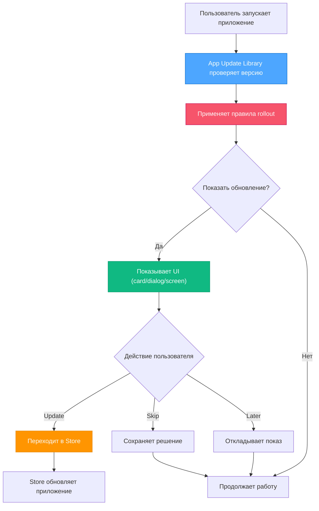

# Product Context: App Update Management System

## Продуктовая миссия
> **"Превратить процесс показа обновлений в мощный инструмент управления пользовательским опытом"**

Предоставить разработчикам систему для:
- **Умного показа обновлений** с правильным timing и контекстом
- **Мотивации пользователей** к своевременному обновлению
- **Безопасного rollout** новых версий с контролем рисков
- **Персонализированного UX** без дополнительной сложности

## Принципиальная модель работы

### НЕ обновляем сами ❌
```
Пользователь → App Update Library → Прямое обновление ❌
```

### Показываем и перенаправляем ✅
```
Пользователь → App Update Library → Показ UI → Перенаправление в Store → Обновление
                    ↑
            Rollout правила + UX
```

## Ключевые сценарии использования

### 1. Критические обновления безопасности
```yaml
# Немедленный показ для unsupported версий
app_settings:
  - app_version_is: "<1.0.0"
    data:
      app_status: unsupported

settings:
  - app_status_is: unsupported
    view_target_is: screen    # Полноэкранный блокирующий экран
    data:
      should_show: true
      can_skip: false         # Нельзя пропустить
      can_postpone: false     # Нельзя отложить

content:
  - app_status_is: unsupported
    data:
      title: "Критическое обновление"
      description: "Ваша версия больше не поддерживается по соображениям безопасности"
```

### 2. Постепенный rollout новых функций
```yaml
# Осторожный выкат на 25% пользователей за неделю
app_settings:
  - date: $updateReleaseDate
    delay_hours: 24              # Сутки на стабилизацию
    gradual_rollout_hours: 168           # Неделя на полный rollout  
    user_segmentation_percent: 25     # Только четверть пользователей
    data:
      app_status: outdated

settings:
  - app_status_is: outdated
    view_target_is: card         # Ненавязчивая карточка
    data:
      should_show: true
      can_skip: true             # Можно пропустить
      can_postpone: true         # Можно отложить
```

### 3. Локализованная мотивация
```yaml
content:
  # Базовый английский контент
  - data:
      title: "Update Available"
      description: "Version $releaseVersion with new features"
      update_button: "Update Now"
      
  # Русская локализация с emotional appeal
  - locale_is: ru
    data:
      title: "Доступно обновление"
      description: "Версия $releaseVersion с новыми возможностями и улучшениями"
      update_button: "Обновить сейчас"
      
  # Для критических статусов - более настойчиво
  - locale_is: ru
    app_status_is: deprecated
    data:
      title: "Важное обновление"
      description: "Ваша версия устарела. Обновитесь для получения новых функций и исправлений"
```

## Пользовательские персоны

### 1. Flutter Developer (Primary User)
**Потребности:**
- Простая интеграция готового update management
- Кастомизация UI под дизайн приложения
- Контроль логики показа без сложной логики

**Боли которые решаем:**
- Необходимость писать update UI с нуля для каждого приложения
- Сложность координации rollout между платформами
- Отсутствие готовых компонентов для update notifications

**Value Proposition:**
```dart
// Одна строка кода = полная система update management
UpdateHandler.alert(
  child: MyApp(),
)
```

### 2. Product Manager
**Потребности:**
- Контроль over update adoption rates
- A/B тестирование update messaging
- Безопасный rollout critical updates

**Боли которые решаем:**
- Отсутствие гибкости в update UX
- Невозможность gradual rollout
- Lack of control over update timing

**Value Proposition:**
```yaml
# Управление rollout через конфигурацию без code changes
settings:
  - app_status_is: deprecated
    user_segmentation_percent: 10  # A/B test на 10%
    data:
      should_show: true
```

### 3. DevOps Engineer  
**Потребности:**
- Centralized update policy management
- Monitoring rollout progress
- Risk mitigation для breaking changes

**Боли которые решаем:**
- Manual coordination между platforms
- No rollback mechanism for bad updates
- Lack of visibility into update adoption

**Value Proposition:**
- Centralized YAML configuration
- Temporal rules для controlled rollout
- Built-in status monitoring

## Product Positioning

### vs Firebase Remote Config
**Наши преимущества:**
- Специализация именно на update management
- Built-in UI components
- Complex temporal rules из коробки

### vs Platform Native Solutions
**Наши преимущества:**
- Cross-platform consistency
- Advanced rollout control
- Customizable UX

### vs Custom Implementation
**Наши преимущества:**
- Production-ready solution
- Comprehensive testing
- Best practices из коробки

## Ближайшая roadmap (v1.0.0)

### 🎯 Production Complete Package
**Timeline**: 2-3 месяца

#### Core Implementation ✅ → 🔄
- [x] Rule engine и configuration system
- [x] Data pipeline (fetch → parse → link → resolve)
- [ ] **UpdateController methods** (launchUpdateUrl, postponeUpdate, skipUpdate)
- [ ] **Real API integration** для source fetchers
- [ ] **Storage persistence** для user decisions

#### UI Components 📋
- [ ] **Material Design widgets** (dialog, card, snackbar)
- [ ] **Cupertino widgets** для iOS native feel
- [ ] **Adaptive components** с platform detection
- [ ] **Customizable theming** integration

#### Documentation & DX 📋
- [ ] **Comprehensive README** с quick start
- [ ] **Configuration guide** с примерами
- [ ] **API reference** documentation
- [ ] **Migration guides** between versions
- [ ] **Best practices** guide

#### Quality Assurance 📋
- [ ] **95%+ test coverage** для всех компонентов
- [ ] **Platform-specific testing** 
- [ ] **Integration testing** с real apps
- [ ] **Performance benchmarking**

## Долгосрочная vision

### Phase 2: Advanced Integration (v2.0.0)
**Timeline**: 6-12 месяцев после v1.0.0

#### Native Update Integration
1. **Android In-App Updates**
   ```dart
   // Seamless updates без перехода в Play Store
   UpdateController(
     enableInAppUpdates: true,
     fallbackToStore: true,
   )
   ```

2. **Self-Update для Desktop**
   ```dart
   // Windows MSI/EXE self-update
   // macOS DMG update mechanisms  
   // Linux AppImage updates
   UpdateController(
     enableSelfUpdate: true,
     updateMechanism: UpdateMechanism.platform,
   )
   ```

#### Advanced Capabilities
3. **APK Direct Download** для Android (outside Play Store)
4. **Background update downloads** с user consent
5. **Delta updates** для reduced bandwidth

### Phase 3: Enterprise Features (v3.0.0)
**Timeline**: 12+ месяцев

#### Analytics & Monitoring
- Update adoption analytics
- Rollout performance metrics
- User behavior insights

#### Cloud Integration
- Remote configuration management
- Real-time policy updates
- Centralized monitoring dashboard

## Success Metrics v1.0.0

### Developer Adoption
- **Time to integration**: < 30 минут
- **Configuration complexity**: < 10 YAML строк для basic setup
- **Breaking changes**: 0 в stable API

### Functionality Completeness
- **TODO completion**: 100%
- **UI coverage**: All major display targets
- **Platform coverage**: All declared platforms working

### Quality Standards
- **Test coverage**: 95%+
- **Documentation completeness**: 100% public API documented
- **Real-world validation**: Tested в production apps

## User Journey Example

### Typical User Flow


## Value Proposition Summary
**"Превращаем хаотичный процесс показа обновлений в controlled, data-driven, user-friendly experience с минимальными усилиями разработчика"**

### Для разработчика:
- 5 минут integration вместо недель custom development
- Type-safe configuration вместо hardcoded logic  
- Production-ready components вместо DIY solutions

### Для продукта:
- Контролируемый rollout вместо "all-or-nothing" updates
- Data-driven decisions вместо guesswork
- Improved user retention через better update UX

### Для пользователей:
- Понятные update notifications вместо cryptic messages
- Выбор timing обновления вместо forced updates
- Seamless experience вместо disruptive interruptions
